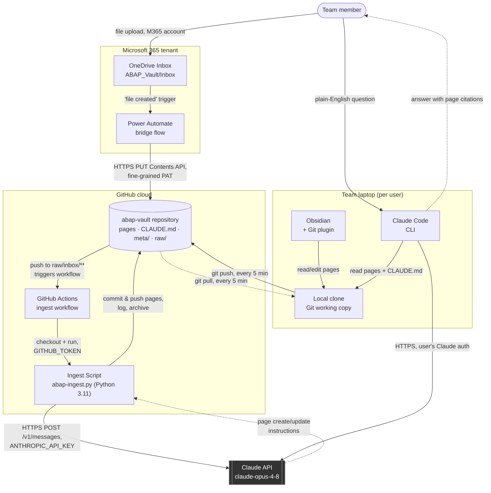

# System Architecture Diagram

This diagram shows the ABAP LLM Wiki's internal components across its three planes — ingestion (Microsoft 365), storage/automation (GitHub cloud), and consumption (team laptops) — and how it reaches its two external boundaries: **GitHub-hosted automation** and the **Claude API**.

## How the Microsoft world reaches GitHub — and how GitHub reaches Claude

The entire system hangs on one deliberately small bridge: a Power Automate flow performs a single authenticated **HTTPS PUT to GitHub's Contents API**, committing each dropped OneDrive file into the repo's `raw/inbox/` folder. That commit _is_ the trigger — GitHub's own push event starts the ingest workflow; there is no polling and no second integration. The only other outbound dependency is one HTTPS call from the ingest script to the **Claude API** (authenticated by a repository secret). Humans never touch this pipeline: they meet the wiki through ordinary Git sync (Obsidian) and local reads (Claude Code).

## Diagram

**Reading the diagram:**

- Solid arrows = request/command direction; dashed = responses and pulled data.
- Dark boxes = external systems this app depends on but doesn't control (the Claude API).
- The cylinder is the Git repository — the single source of truth every other component reads from or writes to.
